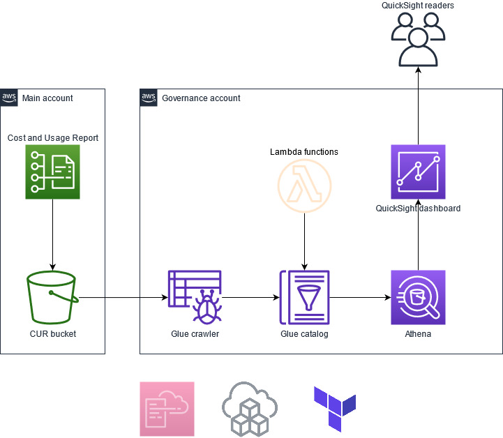

# CUDOS



## 1. Prerequisites

* [ ] AWS Cli is installed 
* [ ] Terraform Cli is installed
* [ ] Two AWS accounts:
  * The main account is the one generate the cost and usage reports
  * The governance account is the one own the QuickSight dashboard
* [ ] `jq`

If you're using AWS Cloud9, disable the AWS managed temporary credentials and 
use an EC2 instance profile with enough permissions ([read more](https://devsecops.job4u.io/en/prerequisites/bootstrap/admin-iam-role/)).

## 2. Prepare CUR data


### If you already have CUR data in S3

* Share the S3 bucket with the governance account by updating the bucket policy to adding this
  
```json
{
  "Sid": "",
  "Effect": "Allow",
  "Principal": {
    "AWS": "arn:aws:iam::<AWS Governance account ID>:root"
  },
  "Action": "s3:ListBucket",
  "Resource": "arn:aws:s3:::<CUR bucket name>"
},
{
  "Sid": "",
  "Effect": "Allow",
  "Principal": {
  "AWS": "arn:aws:iam::<AWS Governance account ID>:root"
  },
  "Action": "s3:GetObject",
  "Resource": "arn:aws:s3:::<CUR bucket name>/*"
}
```
* Take note the CUR bucket name and bucket region.
* Find the path to the `crawler-cfn.yml` file in the CUR bucket. For example, if the path to that file is `s3://somebucket/MyPrefix/CostReport/crawler-cfn.yml`
  * `MyPrefix/` is the S3 prefix.
  * `CostReport` is the CUR report name.
  
Finally, give these pieces of information to the governance account

```
cur_bucket_name=Name of the CUR bucket
cur_bucket_region=Region of the CUR bucket
cur_prefix=The prefix defined in the previous step
cur_report_name=The report name defined in the previous step
```

### If we don't have Cost and Usage report setup yet

Run this command with the AWS profile that have the permission to configure the cost and usage reports.
The command create a S3 bucket and set the appropriate permission to the governance account.

```shell
./setup_cur.sh -i <the AWS account ID of the governance acocunt> -p <AWS main account profile> -r <AWS region for S3 bucket> 
```

```
export AWS_PROFILE=default
export AWS_ACCOUNT="11111111111"
export AWS_REGION=${AWS_REGION:-"ap-southeast-1"}

./setup_cur.sh -i ${AWS_ACCOUNT} -p ${AWS_PROFILE} -r ${AWS_REGION}
```

The only required arguments are `-i`, the rest are optional:
* `-p` default to the `default` AWS profile.
* `-r` default to `ap-southeast-1`.

## 3. Build the CUDOS dashboard

### 3.1 Setup Athena with Glue crawler

The values of parameters is gotten from the previous step.

Run the following script
```shell
./setup_data.sh -b <cur_bucket_name> -s <cur_prefix> -n <cur_report_name> -p <AWS profile> -r <AWS region>
```

### 3.2 Prepare the QuickSight account

* [Enable QuickSight](https://docs.aws.amazon.com/quicksight/latest/user/signing-up.html):
  * Choose Enterprise Edition (to use the create dashboard API)
  * Choose region: Singapore (the same as the CUR bucket region)
  * Enable integration with Athena
  * Enable integration with S3, choosing some buckets
    * The CUR report bucket (with read permission)
    * The Athena results bucket (with write permission)
  
* Prepare Athena primary [workgroup output location](https://cudos.workshop.aws/prerequisites/prepare-athena.html)
  
### 3.3 Setup QuickSight dashboards

Run the following script
```shell
./setup_quicksight.sh
```

## 4. Clean up

* [Unsubscribe QuickSight](https://docs.aws.amazon.com/quicksight/latest/user/closing-account.html)
* Remove QuickSight user managed policies and roles
* Run `./cleanup_data.sh`

## Demo

### Preparation

* 2 accounts
* Quicksight configuration with Enterprise plan
* configuration file (`.env` or `.ts`)
[ ] The report generation frequency

### Setup

I) Data ingestion
* Set up to generate S3 and provide access to governance account (see 1.1)
* Verify after running: using cli, scripts or GUI

* Extension: not only for cost but also any data related tasks
* Can use AWS CFN cli to run the generated CloudFormation stack from the CUR bucket

II) Data preparation
* Create Glue crawler to prepare data from S3 bucket(s) to the Athena table(s) 
  
  Note: 
  * https://github.com/aws-samples/aws-usage-queries/blob/main/lib/aws-usage-queries.ts#L242
  * Glue crawler run every day
  * If we have Glue Dev Endpoint, we must delete it when not in-use to prevent unwanted charges.
  
* Configure Athena results bucket for the Athena workgroup

III) Run CUDOS
* Have proper .gitignore file
* Use git sub-modules for code reuse
* Check if we have the ListAccounts permisions on the Organization then run the `map` step

* Update the Cost intelligence dashboard to have all 4 tabs content in one screen. 
  Ref: https://wellarchitectedlabs.com/cost/200_labs/200_enterprise_dashboards/

```
brew tap hashicorp/tap
brew install hashicorp/tap/terraform
# brew upgrade hashicorp/tap/terraform
```
